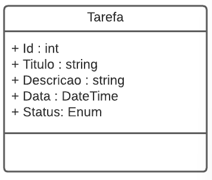

# DIO - Trilha .NET - API e Entity Framework

## Desafio de projeto
Para este desafio, vou usar meus conhecimentos adquiridos no módulo de API e Entity Framework.

## Contexto
Vou precisar construir um sistema gerenciador de tarefas, onde vou poder cadastrar uma lista de tarefas que permitirá organizar melhor a minha rotina.

Essa lista de tarefas precisa ter um CRUD, ou seja, deverá permitir obter os registros, criar, salvar e deletar esses registros.

A será do tipo Web API.

A sua classe principal, a classe de tarefa, deve ser a seguinte:

## Swagger

